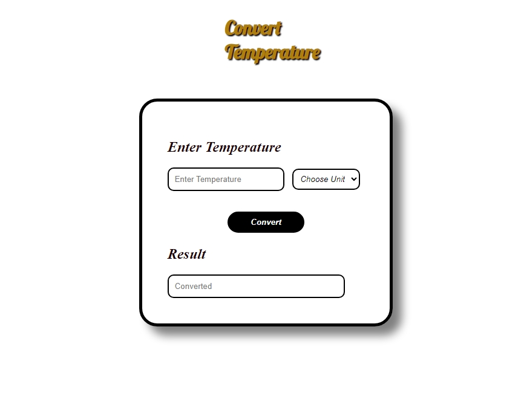

# kishan-OIBSIP
### 🏆 **Multi-Project Repository** 🏆  
**📌 Repository:** [Kishan OIBSIP](https://github.com/Kishan-shr/kishan-OIBSIP)  

This repository contains three different projects:  

1. **Task 1 - Max-Travel Website** 🏝️  
2. **Task 2 - Portfolio Website** 💼  
3. **Task 3 - Temperature Converter** 🌡️  

---
 
 
 

## 🚀 Tech Stack & Tools  

| Technology | Description |
|------------|-------------|
|  | Structure & Layout |
|  | Styling & Design |
|  | Functionality & Logic |
|  | Icons & UI Enhancements |
|  | Custom Typography |
|  | Version Control |

---

## 📂 Project Structure  

```
/kishan-OIBSIP
│── /Task-1 (Max-Travel)
│   ├── index.html
│   ├── style.css
│   ├── assets/
│
│── /Task-2 (Portfolio)
│   ├── index.html
│   ├── style.css
│   ├── phone.css
│   ├── tablet.css
│   ├── assets/
│
│── /Task-3 (Temperature-Converter)
│   ├── index.html
│   ├── style.css
│   ├── index.js
│   ├── images/
│
│── README.md
```

---

## ✨ **Task 1 - Max-Travel Website** 🏝️  

🌍 **Max-Travel** is a travel agency website that allows users to explore destinations and book trips.  

### 🎯 Features  
✅ Stylish navigation menu  
✅ "Book Now" button for quick booking  
✅ Responsive design for better user experience  
✅ Social media icons in the footer  

### 📂 Files  
📌 `index.html` – Structure of the website  
📌 `style.css` – Styling and layout  
📌 `assets/` – Images and icons  

💻 **Live Preview:** [Max-Travel Demo](#) _(Add deployed link if available)_  

---

## 💼 **Task 2 - Portfolio Website**  

👨‍💻 **Portfolio of Kishan Sharma** showcasing projects, services, and contact information.  

### 🎯 Features  
✅ Responsive design (works on mobile & tablet)  
✅ Smooth scrolling navigation  
✅ Portfolio section with images  
✅ Contact form for inquiries  

### 📂 Files  
📌 `index.html` – Structure of the portfolio  
📌 `style.css` – Main styling file  
📌 `phone.css`, `tablet.css` – Responsive styles  
📌 `assets/` – Images and resources  

💻 **Live Preview:** [Portfolio Demo](#) _(Add deployed link if available)_  

---

## 🌡️ **Task 3 - Temperature Converter**  

🔄 **A simple tool to convert temperatures between Celsius & Fahrenheit.**  

### 🎯 Features  
✅ Enter temperature and select unit  
✅ Instant conversion on button click  
✅ Alerts if temperature is above fever level (>37°C)  
✅ Minimalist & user-friendly design  

### 📂 Files  
📌 `index.html` – Input fields and buttons  
📌 `style.css` – Styling for the converter  
📌 `index.js` – JavaScript logic for conversion  

  ## Author
Developed with ❤️ by KISHAN SHARMA
linkedin : https://www.linkedin.com/in/kishanshr/

💻 **Live Preview:** [Temperature Converter Demo](#) _(Add deployed link if available)_  

---

## 🛠️ **Getting Started**  

To run any of these projects, simply open the respective `index.html` file in a browser.  

Alternatively, if using a local development server:  

```sh
# Clone the repository
git clone https://github.com/Kishan-shr/kishan-OIBSIP.git

# Navigate to the project folder
cd Task-1   # or Task-2 / Task-3

# Open the HTML file in a browser
open index.html  # macOS
start index.html  # Windows
```

For **Task 3 (Temperature Converter)**, ensure JavaScript is enabled in your browser.

---

## 📧 **Contact**  

For any inquiries, feel free to reach out!  

👤 **Portfolio Owner:** [Kishan Sharma](#) _(Add LinkedIn or Portfolio link)_  
🌍 **Travel Agency:** Max-Travel Team  

---

Hope this README looks great! Let me know if you'd like any more enhancements. 🚀😊

